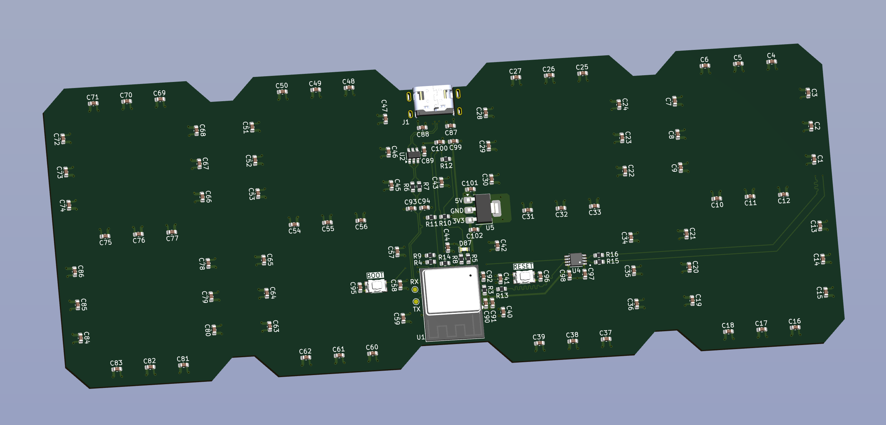

# RGB LED 7-Segment Bedside Clock with Ambient Light and Proximity Sensor

## Features
- USB C Port for Power, Comms, and Programming
    - Connects to the ESP32-C3's onboard USB-CDC/JTAG device
- ESP32-C3 Module for control
    - Allows pattern changing over WiFi/Bluetooth, as well as the buttons on the device
- Integrated Ambient Light and Proximity Sensor
    - Allows the clock to be used at night and stay idle unless desired
- 86 Addressable RGB LEDs
    - APA102-style (DotStar) 2-Wire Control with Global Dimmer and Clock
    - HD107S-5050
    
## Table Of Contents
- [Features](#features)
- [Bill Of Materials](#bill-of-materials)
- [Part Selection](#part-selection)
- [Case Design](#case-design)
- [Code](#code)
- [Extra Notes](#extra-notes)

## Bill of Materials
<!--  
- NAME - FUNC
    - Component: REF
    - Quantity: 
    - [Datasheet]()
    - [DigiKey]()
-->
- Espressif ESP32-C3-MINI-1 - Microcontroller Module w/ WiFi and Bluetooth
    - Component: U1
    - Quantity: 1
    - [Datasheet](https://www.espressif.com/sites/default/files/documentation/esp32-c3-mini-1_datasheet_en.pdf)
    - [DigiKey](https://www.digikey.com/en/products/detail/espressif-systems/ESP32-C3-MINI-1-N4-A/15817506)
- STMicroelectronics USBLC6-2SC6 - USB Data and Power TVS Diode
    - Component: U2
    - Quantity: 1
    - [Datasheet](https://www.st.com/content/ccc/resource/technical/document/datasheet/06/1d/48/9c/6c/20/4a/b2/CD00050750.pdf/files/CD00050750.pdf/jcr:content/translations/en.CD00050750.pdf)
    - [DigiKey](https://www.digikey.com/en/products/detail/stmicroelectronics/USBLC6-2SC6/1040559)
- Vishay VCNL4040M3OE - Combination Ambient Light and Proximity Sensor
    - Component: U3
    - Quantity: 1
    - [Datasheet](https://www.vishay.com/docs/84274/vcnl4040.pdf)
    - [DigiKey](https://www.digikey.com/en/products/detail/vishay-semiconductor-opto-division/VCNL4040M3OE/5171283)
- TI SN74LVC2T45DCTR - Two Channel Fast Level Shifter (from 3V3 MCU to 5V LEDs)
    - Component: U4
    - Quantity: 1
    - [Datasheet](https://www.ti.com/lit/ds/symlink/sn74lvc2t45.pdf)
    - [DigiKey](https://www.digikey.com/en/products/detail/texas-instruments/SN74LVC2T45DCTR/639457)
- Microchip MCP1825ST-3302E/DB - 3V3 Low Noise LDO (500mA)
    - Component: U5
    - Quantity: 1
    - [Datasheet](https://ww1.microchip.com/downloads/en/DeviceDoc/22056b.pdf)
    - [DigiKey](https://www.digikey.com/en/products/detail/microchip-technology/MCP1825ST-3302E-DB/1635518)
- HD107S - APA102 Style Addressable RGB LED with Global Dimmer and Clock 
    - Component: D1 - D86
    - Quantity: 86
    - [Datasheet](https://cdn.hackaday.io/files/1677667177700544/HD107S%20%20Pixel%20RGB%205050%20LED%20chip%20%20Specificaion%20V1.0.1.pdf)
    - [LED Lighting Hut](https://www.ledlightinghut.com/hd107s-5050-rgb-led.html)
- Würth Elektronik 150060VS55040 - Green Indicator LED (LED_BUILTIN)
    - Component: D87
    - Quantity: 1
    - [Datasheet](https://www.we-online.com/components/products/datasheet/150060VS55040.pdf)
    - [DigiKey](https://www.digikey.com/en/products/detail/w%C3%BCrth-elektronik/150060VS55040/8557182)
- GCT USB4520-03-0-A - Midmount USB 2.0 Type C Port
    - Component: J1
    - Quantity: 1
    - [Datasheet](https://gct.co/files/specs/usb4520-spec.pdf)
    - [DigiKey](https://www.digikey.com/en/products/detail/gct/USB4520-03-0-A/15283199)
- E-Switch TL6330AF200Q - Tactile Normally Open Push Button 
    - Component: SW1 - SW4
    - Quantity: 4
    - [Datasheet](https://configured-product-images.s3.amazonaws.com/Datasheets/TL6330.pdf)
    - [DigiKey](https://www.digikey.com/en/products/detail/e-switch/TL6330AF200Q/8032037)
- 100nF - Yageo 0603 Ceramic Capacitor
    - Component: C1 - C86, C89, C91, C96, C98, C99
    - Quantity: 13
    - [DigiKey](https://www.digikey.com/en/products/detail/yageo/CC0603KRX7R7BB104/302822)
- 1µF - Yageo 0603 Ceramic Capacitor
    - Component: C87, C92, C102
    - Quantity: 3
    - [DigiKey](https://www.digikey.com/en/products/detail/yageo/CC0603KRX5R8BB105/2833610)
- 10µF - Yageo 0603 Ceramic Capacitor
    - Component: C88, C90, C97
    - Quantity: 3
    - [DigiKey](https://www.digikey.com/en/products/detail/yageo/CC0603MRX5R6BB106/5195224)
- 22pF - Yageo 0603 Ceramic Capacitor
    - Component: C93, C94
    - Quantity: 2
    - [DigiKey](https://www.digikey.com/en/products/detail/yageo/CC0603JRNPO8BN220/5883592)
- 2.2µF - Yageo 0603 Ceramic Capacitor
    - Component: C100
    - Quantity: 1
    - [DigiKey](https://www.digikey.com/en/products/detail/yageo/CC0603KRX5R7BB225/5195192)
- 4.7µF - Yageo 0603 Ceramic Capacitor
    - Component: C101
    - Quantity: 1
    - [DigiKey](https://www.digikey.com/en/products/detail/yageo/CC0603KRX5R7BB475/5195193)
- 5.1kΩ - Yageo 0603 SMD Resistor
    - Component: R1, R2
    - Quantity: 2
    - [DigiKey](https://www.digikey.com/en/products/detail/yageo/RC0603FR-075K1L/727268)
- 10kΩ - Yageo 0603 SMD Resistor
    - Component: R3, R4, R8, R9
    - Quantity: 4
    - [DigiKey](https://www.digikey.com/en/products/detail/yageo/RC0603FR-1010KL/12756395)
- 1.43kΩ - Yageo 0603 SMD Resistor
    - Component: R5
    - Quantity: 1
    - [DigiKey](https://www.digikey.com/en/products/detail/yageo/RC0603FR-071K43L/726862)
- 0Ω - Yageo 0603 SMD Resistor
    - Component: R6, R7
    - Quantity: 2
    - [DigiKey](https://www.digikey.com/en/products/detail/yageo/RC0603JR-070RL/726675)
- 3.3kΩ - Yageo 0603 SMD Resistor
    - Component: R10, R11
    - Quantity: 2
    - [DigiKey](https://www.digikey.com/en/products/detail/yageo/RC0603FR-073K3L/727126)
- 8.2kΩ - Yageo 0603 SMD Resistor
    - Component: R12
    - Quantity: 1
    - [DigiKey](https://www.digikey.com/en/products/detail/yageo/RC0603FR-078K2L/727390)
- 33Ω - Yageo 0603 SMD Resistor
    - Component: R13 - R16
    - Quantity: 4
    - [DigiKey](https://www.digikey.com/en/products/detail/yageo/RC0603FR-0733RL/727158)

## Case Design
<!--  TODO: Case design needs to be updated  -->
<!--    -->
- 3D Printed Chassis

## Code
<!-- Nothing Written Yet -->
- To view all the code, see it [here](code)

## Extra Notes
